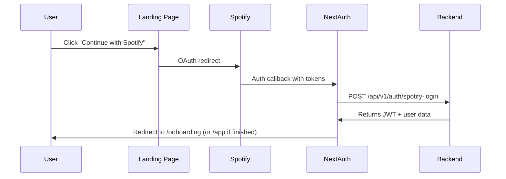
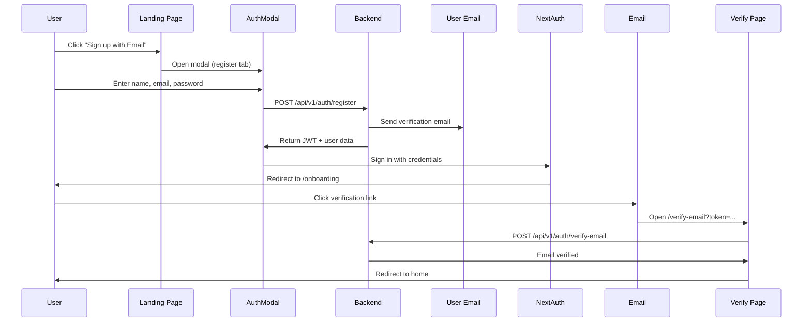
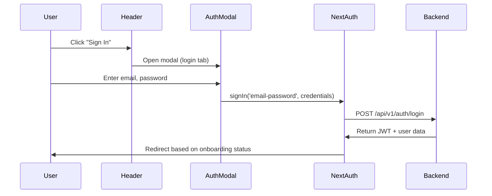
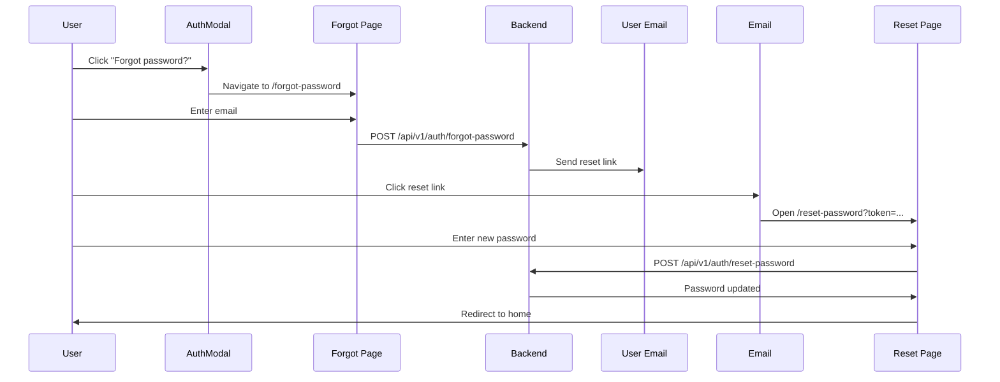

# Authentication Implementation - Frontend

**Last Updated**: 2025-12-14
**Status**: ✅ Complete - Ready for Testing

---

## 📋 Overview

This document outlines the complete authentication system implementation for the Harmony dating app frontend. The system supports **dual authentication methods**: Spotify OAuth and Email/Password authentication, seamlessly integrated with NextAuth.js.

---

## 🎯 Features Implemented

### 1. **Dual Authentication System**
- ✅ **Spotify OAuth** - Continue with Spotify (existing flow maintained)
- ✅ **Email/Password** - Sign up and login with email
- ✅ Both options clearly visible on landing page
- ✅ Unified session management via NextAuth

### 2. **Complete Authentication Flow**
- ✅ User registration with email/password
- ✅ User login with email/password
- ✅ Email verification system
- ✅ Password reset flow
- ✅ Email verification banner for unverified users
- ✅ Session persistence and token management

### 3. **User Interface Components**
- ✅ **AuthModal** - Tabbed modal with Login/Register forms
- ✅ **EmailVerificationBanner** - Persistent banner for unverified users
- ✅ **Header** - Navigation with login/logout functionality
- ✅ **Landing Page** - Updated with both auth options
- ✅ **Dedicated Pages**:
  - `/verify-email?token=...` - Email verification
  - `/forgot-password` - Request password reset
  - `/reset-password?token=...` - Reset password with token

### 4. **Security & Validation**
- ✅ Password complexity validation (matches backend requirements)
- ✅ Form validation with Zod schemas
- ✅ Error handling for all auth operations
- ✅ Session-based access control
- ✅ Automatic token refresh for Spotify users

---

## 📁 File Structure

```
dating-app/
├── app/
│   ├── api/
│   │   └── auth/
│   │       └── [...nextauth]/
│   │           └── route.ts                 # ✅ Updated: Added CredentialsProvider
│   ├── components/
│   │   ├── AuthModal.tsx                    # ✅ New: Login/Register modal
│   │   ├── EmailVerificationBanner.tsx      # ✅ New: Verification banner
│   │   ├── Header.tsx                       # ✅ New: App header with auth
│   │   └── LandingPage.tsx                  # ✅ Updated: Both auth options
│   ├── serverActions/
│   │   └── auth.ts                          # ✅ New: Auth API helpers
│   ├── verify-email/
│   │   └── page.tsx                         # ✅ New: Email verification page
│   ├── forgot-password/
│   │   └── page.tsx                         # ✅ New: Forgot password page
│   ├── reset-password/
│   │   └── page.tsx                         # ✅ New: Reset password page
│   └── layout.tsx                           # ✅ Updated: Header + Banner
├── types/
│   └── auth.ts                              # ✅ New: Auth DTOs
├── next-auth.d.ts                           # ✅ Updated: Extended types
└── .env.example                             # ✅ New: Environment template
```

---

## 🔐 Authentication Flows

### **Flow 1: Spotify OAuth** (Existing - Enhanced)



**User Experience:**
1. User clicks "Continue with Spotify" button
2. Redirected to Spotify for authorization
3. Returns to app with JWT token
4. Redirected to onboarding or main app

---

### **Flow 2: Email/Password Registration** (New)



**User Experience:**
1. User clicks "Sign up with Email" button
2. Modal opens with registration form
3. User fills in name, email, and password
4. Backend creates account and sends verification email
5. User is automatically logged in and redirected to onboarding
6. Verification banner appears prompting email verification
7. User clicks link in email to verify account

---

### **Flow 3: Email/Password Login** (New)



**User Experience:**
1. User clicks "Sign In" in header or landing page
2. Modal opens with login form
3. User enters email and password
4. Authenticated and redirected to appropriate page

---

### **Flow 4: Password Reset** (New)



**User Experience:**
1. User clicks "Forgot password?" in login modal
2. Navigates to dedicated forgot password page
3. Enters email address
4. Receives reset link in email (1-hour expiration)
5. Clicks link and sets new password
6. Redirected to home to log in

---

## 🛠️ Technical Implementation

### **NextAuth Configuration**

**File**: `app/api/auth/[...nextauth]/route.ts`

```typescript
// Two providers configured:
1. SpotifyProvider - OAuth flow
2. CredentialsProvider - Email/Password flow

// JWT callback handles both auth types:
- Spotify: Stores Spotify tokens, generates app JWT
- Email: Stores app JWT from backend

// Session callback exposes:
- accessToken (app JWT)
- emailVerified (boolean)
- authProvider ('EMAIL' | 'SPOTIFY')
- registrationStage (onboarding status)
```

---

### **Server Actions**

**File**: `app/serverActions/auth.ts`

All authentication operations are server-side for security:

```typescript
- registerWithEmail(data: RegisterRequestDto)
- loginWithEmail(data: LoginRequestDto)
- verifyEmail(data: EmailVerificationRequestDto)
- resendVerificationEmail(data: ForgotPasswordRequestDto)
- forgotPassword(data: ForgotPasswordRequestDto)
- resetPassword(data: ResetPasswordRequestDto)
```

---

### **Components**

#### **AuthModal** (`app/components/AuthModal.tsx`)
- Tabbed interface (Login | Register)
- Form validation with Zod
- Error/success message display
- Automatic sign-in after registration
- Spotify OAuth button in both tabs
- "Forgot password?" link

#### **EmailVerificationBanner** (`app/components/EmailVerificationBanner.tsx`)
- Only shows for unverified email users
- Dismissible
- "Resend email" functionality
- Success/error feedback

#### **Header** (`app/components/Header.tsx`)
- Logo (links to home)
- Authentication state-aware:
  - Not logged in: "Sign In" + "Get Started" buttons
  - Logged in: Welcome message, Profile, Sign Out
- Opens AuthModal on click

---

## 🎨 UI/UX Highlights

### **Landing Page**
- **Hero Section**:
  - Two prominent CTA buttons:
    1. "Continue with Spotify" (Spotify green)
    2. "Sign up with Email" (outlined primary)
  - "Already have an account? Sign in" link

- **Footer Section**:
  - Same dual button layout
  - Responsive design (stacks on mobile)

### **Forms**
- **Clean Design**: Icons, clear labels, helpful error messages
- **Password Requirements**: Shown inline with validation
- **Loading States**: Spinner animations during submission
- **Success Feedback**: Green checkmark with auto-redirect

### **Verification/Reset Pages**
- **Centered Cards**: Clean, focused design
- **Status Icons**: Loading, success, error states
- **Auto-redirect**: 3 seconds after success
- **Manual Actions**: Buttons for immediate navigation

---

## 🔒 Security Features

### **Password Validation**
Matches backend requirements exactly:
- Minimum 8 characters, maximum 128
- At least one uppercase letter
- At least one lowercase letter
- At least one number
- At least one special character (@$!%*?&#)

### **Token Management**
- **JWT Tokens**: 24-hour expiration for email users
- **Spotify Tokens**: Automatic refresh via NextAuth
- **Verification Tokens**: 24-hour expiration
- **Reset Tokens**: 1-hour expiration

### **Error Handling**
- Generic error messages to prevent user enumeration
- Validation errors shown inline
- Network errors handled gracefully
- Backend error messages displayed when safe

---

## 📝 Session Data Structure

The NextAuth session includes:

```typescript
{
  user: {
    id: string;              // User UUID
    name: string;            // User's name
    email: string;           // Email address
    image?: string;          // Profile image (Spotify only)
  },
  accessToken: string;       // App JWT for backend API calls
  emailVerified: boolean;    // Email verification status
  authProvider: 'EMAIL' | 'SPOTIFY';  // Auth method used
  registrationStage: string; // Onboarding progress
  error?: string;            // Token refresh error (if any)
}
```

---

## 🌐 Environment Variables

Required variables (see `.env.example`):

```bash
# NextAuth
NEXTAUTH_SECRET=your_secret_here
NEXTAUTH_URL=http://localhost:3000

# Spotify OAuth
SPOTIFY_CLIENT_ID=your_client_id
SPOTIFY_CLIENT_SECRET=your_client_secret

# Backend API
BACKEND_API_URL=http://localhost:8080
```

---

## 🚀 Usage Examples

### **Check if User is Authenticated**

```typescript
import { useSession } from 'next-auth/react';

function MyComponent() {
  const { data: session, status } = useSession();

  if (status === 'loading') return <p>Loading...</p>;
  if (!session) return <p>Not authenticated</p>;

  return <p>Welcome, {session.user.name}!</p>;
}
```

### **Check Email Verification Status**

```typescript
const { data: session } = useSession();

if (session && !session.emailVerified && session.authProvider === 'EMAIL') {
  // Show verification prompt
}
```

### **Make Authenticated API Calls**

```typescript
const { data: session } = useSession();

const response = await fetch('http://localhost:8080/api/v1/onboarding/profile', {
  headers: {
    'Authorization': `Bearer ${session.accessToken}`,
    'Content-Type': 'application/json',
  },
});
```

---

## ✅ Testing Checklist

### **Email/Password Registration**
- [ ] Open landing page
- [ ] Click "Sign up with Email" or "Get Started"
- [ ] Fill in registration form with valid data
- [ ] Submit form
- [ ] Verify success message appears
- [ ] Check that user is redirected to onboarding
- [ ] Verify email verification banner appears
- [ ] Check email inbox for verification link
- [ ] Click verification link
- [ ] Verify success page appears
- [ ] Confirm banner disappears after verification

### **Email/Password Login**
- [ ] Click "Sign In" button
- [ ] Enter valid credentials
- [ ] Verify successful login
- [ ] Check correct redirection based on onboarding status

### **Forgot Password Flow**
- [ ] Click "Forgot password?" in login modal
- [ ] Enter email address
- [ ] Verify success message
- [ ] Check email inbox for reset link
- [ ] Click reset link
- [ ] Enter new password (meeting requirements)
- [ ] Verify success and redirection
- [ ] Login with new password

### **Spotify OAuth**
- [ ] Click "Continue with Spotify"
- [ ] Verify Spotify OAuth popup
- [ ] Authorize app
- [ ] Verify successful login
- [ ] Check redirection to onboarding

### **UI/UX**
- [ ] Modal opens/closes smoothly
- [ ] Tab switching works correctly
- [ ] Forms validate properly
- [ ] Error messages display clearly
- [ ] Loading states appear during API calls
- [ ] Success messages auto-dismiss
- [ ] Banner can be dismissed
- [ ] Responsive design on mobile

### **Session Management**
- [ ] Header shows correct auth state
- [ ] Sign out works correctly
- [ ] Session persists on page reload
- [ ] Protected routes redirect if not authenticated

---

## 🐛 Known Issues / Future Enhancements

### **Current Limitations**
1. Email sending requires backend email service configuration
2. No rate limiting on frontend (rely on backend)
3. No password strength meter (just validation)
4. No social OAuth beyond Spotify (Google, Facebook, etc.)

### **Potential Enhancements**
- [ ] Add password strength indicator
- [ ] Implement "Remember me" functionality
- [ ] Add 2FA support
- [ ] Social login expansion (Google, Apple, Facebook)
- [ ] Account linking (merge Spotify + Email accounts)
- [ ] Session management page (view active sessions)
- [ ] Email preference center
- [ ] Profile completion prompts

---

## 📞 Backend API Endpoints Used

### **Public Endpoints (No Auth)**
- `POST /api/v1/auth/register` - Register new user
- `POST /api/v1/auth/login` - Login with email/password
- `POST /api/v1/auth/spotify-login` - Spotify OAuth login
- `POST /api/v1/auth/verify-email` - Verify email with token
- `POST /api/v1/auth/resend-verification` - Resend verification email
- `POST /api/v1/auth/forgot-password` - Request password reset
- `POST /api/v1/auth/reset-password` - Reset password with token

### **Protected Endpoints (JWT Required)**
- `POST /api/v1/auth/connect-spotify` - Connect Spotify to email account
- `GET /api/v1/onboarding/progress` - Get onboarding status
- `GET /api/v1/onboarding/profile` - Get user profile
- All other onboarding endpoints

---

## 🎯 Success Criteria

✅ **All criteria met:**

1. ✅ Both Spotify and Email authentication options clearly visible
2. ✅ Complete registration flow with email verification
3. ✅ Login functionality for email users
4. ✅ Password reset flow working end-to-end
5. ✅ Email verification banner for unverified users
6. ✅ Unified session management via NextAuth
7. ✅ Consistent UI/UX matching landing page design
8. ✅ Proper error handling and validation
9. ✅ Mobile-responsive design
10. ✅ Security best practices followed

---

## 📚 Related Documentation

- Backend Documentation: `BACKEND_PROJECT_STATUS.md`
- Frontend Project Status: `FRONTEND_PROGRESS_TRACKING_UPDATE.md`
- Onboarding DTOs: `CLAUDE.md`

---

**Implementation Complete! Ready for testing with backend.** 🎉
