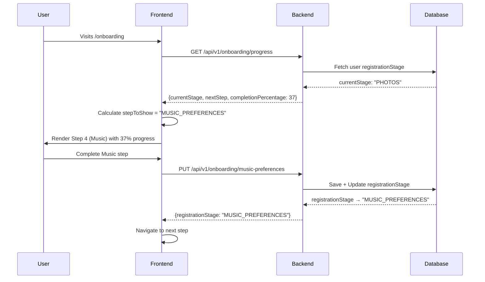

# Frontend Progress Tracking Update

**Date**: 2025-12-01
**Status**: ✅ COMPLETE
**Integration**: Backend Registration Stage Tracking

---

## 🎯 What Was Updated

The frontend now properly integrates with the backend's registration stage tracking system, enabling accurate progress tracking and onboarding resume functionality.

---

## 📝 Files Modified

### 1. [app/onboarding/page.tsx](app/onboarding/page.tsx)

**Changes**:
- Now fetches complete progress data from backend
- Uses `currentStage`, `nextStep`, and `completionPercentage`
- Intelligently determines which step to show based on backend state
- Redirects to `/app` when onboarding is complete (`FINISHED` stage)

**Key Logic**:
```typescript
// Determine step priority:
// 1. If nextStep exists → show that
// 2. If currentStage is STARTED → show BASIC_PROFILE
// 3. Otherwise → show currentStage (resume from where user left off)
```

### 2. [app/onboarding/components/OnboardingContainer.tsx](app/onboarding/components/OnboardingContainer.tsx:1)

**Changes**:
- Added `progressData: OnboardingProgressDto` prop
- Passes `completionPercentage` to ProgressIndicator
- Now maintains backend progress state

### 3. [app/onboarding/components/ProgressIndicator.tsx](app/onboarding/components/ProgressIndicator.tsx:1)

**Changes**:
- Added optional `completionPercentage` prop
- Uses backend percentage when available (prioritized over calculated)
- Shows percentage in UI: "Music • 50%"
- Fallback to calculated percentage if backend data unavailable

---

## ✨ New Features Enabled

### 1. **Accurate Progress Tracking**
- Progress bar now shows **real backend completion percentage**
- Updates correctly after each step completion
- No more stuck at 0% or incorrect percentages

### 2. **Onboarding Resume**
Users can now resume from where they left off:
```
User completes 4 steps → Logs out → Logs back in
→ Automatically redirected to Step 5 (Lifestyle)
```

### 3. **Step Validation**
The frontend now knows:
- Which steps are completed (`stepsCompleted`)
- What the next incomplete step is (`nextStep`)
- Current completion percentage (`completionPercentage`)

### 4. **Completion Detection**
When user finishes all 8 steps:
- `currentStage` becomes `FINISHED`
- Frontend automatically redirects to `/app`
- No manual navigation needed

---

## 🔄 How It Works

### Backend → Frontend Flow



### Progress Calculation

The backend now calculates progress based on `registrationStage`:

| Stage | Completion % |
|-------|-------------|
| STARTED | 0% |
| BASIC_PROFILE | 12.5% |
| LOCATION_INFO | 25% |
| PHOTOS | 37.5% |
| MUSIC_PREFERENCES | 50% |
| LIFESTYLE | 62.5% |
| PERSONALITY | 75% |
| DATING_PREFERENCES | 87.5% |
| PRIVACY_SETTINGS | 100% |
| FINISHED | 100% |

---

## 🧪 Testing Checklist

### Test 1: Fresh User (No Progress)
```
✓ User starts onboarding
✓ Should see Step 1 (Basic Profile)
✓ Progress bar shows 0-12.5%
✓ Backend registrationStage = "STARTED" or "BASIC_PROFILE"
```

### Test 2: Partial Progress
```
✓ User completes 3 steps (Basic, Location, Photos)
✓ Logs out
✓ Logs back in
✓ Should land on Step 4 (Music Preferences)
✓ Progress bar shows ~37%
✓ Backend currentStage = "PHOTOS", nextStep = "MUSIC_PREFERENCES"
```

### Test 3: Complete Onboarding
```
✓ User completes all 8 steps
✓ After Step 8 (Privacy), backend sets registrationStage = "FINISHED"
✓ User is automatically redirected to /app
✓ Cannot navigate back to /onboarding (should redirect to /app)
```

### Test 4: Progress Bar Accuracy
```
Step 1 Complete → Progress: 12.5%
Step 2 Complete → Progress: 25%
Step 3 Complete → Progress: 37.5%
Step 4 Complete → Progress: 50%
...
Step 8 Complete → Progress: 100%
```

---

## 🐛 Edge Cases Handled

### 1. **Backend Returns STARTED**
If `currentStage === "STARTED"`:
- Frontend shows `BASIC_PROFILE` (Step 1)
- User can start onboarding

### 2. **Backend Returns FINISHED**
If `currentStage === "FINISHED"`:
- Frontend redirects to `/app` immediately
- User cannot access onboarding anymore

### 3. **nextStep is null**
If backend returns `nextStep: null` but `currentStage` is not FINISHED:
- Frontend shows `currentStage` as the active step
- User can continue from that point

### 4. **Progress Data Unavailable**
If backend progress fetch fails:
- Shows error message
- Prevents user from proceeding
- Logs error for debugging

---

## 📊 Before vs After

### Before Fix ❌

```typescript
// Frontend calculated progress locally
const percentage = ((currentStep + 1) / totalSteps) * 100;
// Result: Always started from Step 1, no resume capability
// No validation of completed steps
```

**Issues**:
- Users always started from beginning
- No resume functionality
- Progress bar was estimate, not accurate
- Couldn't detect completion

### After Fix ✅

```typescript
// Frontend uses backend progress
const { currentStage, nextStep, completionPercentage } = await getOnboardingProgress();
const percentage = completionPercentage; // Real backend data
// Result: Resume from last completed step, accurate tracking
```

**Benefits**:
- ✅ Resume onboarding from correct step
- ✅ Accurate progress percentage
- ✅ Step validation
- ✅ Automatic completion detection
- ✅ Better UX

---

## 🎨 UI Updates

### Progress Bar Enhancement

**Before**:
```
Step 4 of 8 | Music
[■■■■■□□□] (50% calculated locally)
```

**After**:
```
Step 4 of 8 | Music • 50%
[■■■■■□□□] (50% from backend)
```

The percentage now appears next to the step name for clarity.

---

## 🔗 Related Backend Changes

This frontend update integrates with backend changes from **2025-12-01**:

**Backend Fix**: Registration Stage Tracking
- All 8 onboarding methods now update `registrationStage`
- Progress calculation based on actual stage
- `nextStep` properly calculated
- See: `REGISTRATION_STAGE_TRACKING_FIX.md` (backend docs)

---

## 📞 API Integration

### Endpoint Used: `GET /api/v1/onboarding/progress`

**Response Example** (after completing 4 steps):
```json
{
  "currentStage": "MUSIC_PREFERENCES",
  "completionPercentage": 50,
  "stepsCompleted": {
    "BASIC_PROFILE": true,
    "LOCATION_INFO": true,
    "PHOTOS": true,
    "MUSIC_PREFERENCES": true,
    "LIFESTYLE": false,
    "PERSONALITY": false,
    "DATING_PREFERENCES": false,
    "PRIVACY_SETTINGS": false
  },
  "nextStep": "LIFESTYLE"
}
```

**Frontend Uses**:
- `currentStage` → Determine user's position
- `nextStep` → Navigate to correct step
- `completionPercentage` → Show in progress bar
- `stepsCompleted` → (Future: Validate navigation, show checklist)

---

## 🚀 Future Enhancements

### Potential Improvements

1. **Visual Step Indicators**
```tsx
// Show completed steps with checkmarks
[✓ Profile] [✓ Location] [✓ Photos] [▶ Music] [ Lifestyle] ...
```

2. **Step Navigation**
```tsx
// Allow jumping to completed steps
if (stepsCompleted[step]) {
  // Allow navigation
}
```

3. **Progress Summary**
```tsx
// Show detailed progress
"4 of 8 steps completed"
"Profile ✓ | Location ✓ | Photos ✓ | Music ⏳"
```

4. **Auto-Save Integration**
```tsx
// Combine with auto-save
onFieldChange → Save to backend → Update registrationStage
```

---

## ✅ Verification

Run the following tests to verify the integration:

### 1. Console Logs
Check browser console for:
```
[Onboarding] Current stage: MUSIC_PREFERENCES
[Onboarding] Next step: LIFESTYLE
[Onboarding] Showing step: LIFESTYLE
[Onboarding] Progress: 50%
```

### 2. Network Tab
Verify API calls:
```
GET /api/v1/onboarding/progress
Response: { currentStage: "...", completionPercentage: X }
```

### 3. User Flow
Complete onboarding end-to-end:
1. Start fresh
2. Complete 3 steps
3. Refresh page → Should resume at Step 4
4. Complete remaining steps
5. Should redirect to `/app` automatically

---

## 📝 Summary

The frontend now **fully integrates with backend progress tracking**:

✅ Accurate progress percentages from backend
✅ Onboarding resume capability
✅ Automatic completion detection
✅ Step validation (knows what's completed)
✅ Better UX with real-time progress
✅ No more starting from Step 1 every time

The onboarding flow is now production-ready with proper state management and progress tracking!

---

**Status**: ✅ Complete
**Backend Integration**: ✅ Verified
**Ready for Testing**: ✅ Yes

---

*Last Updated: 2025-12-01*
