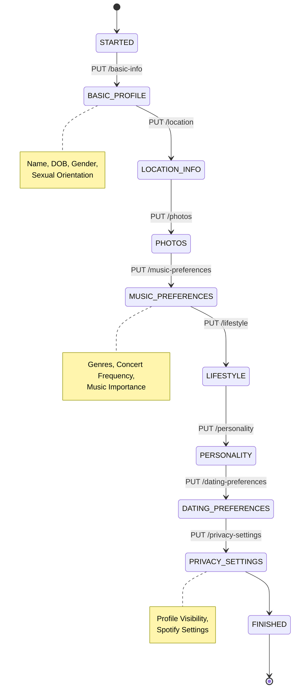
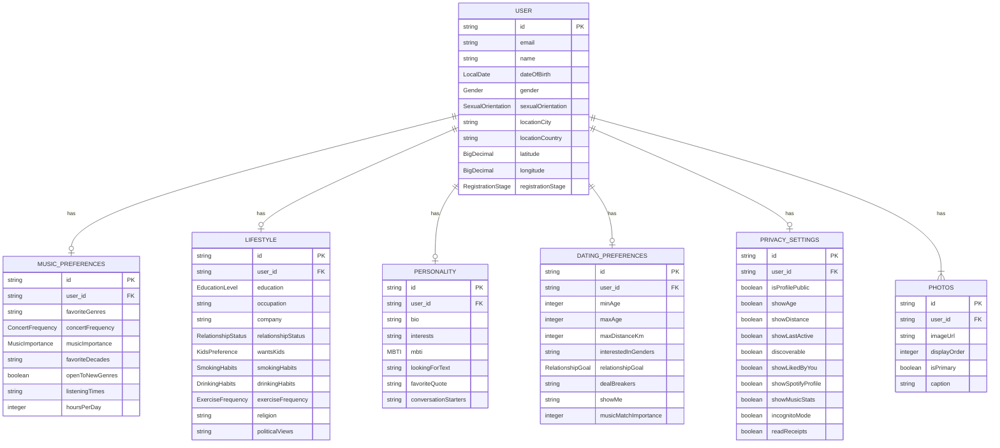

# Onboarding DTOs - Visual Documentation

## Overview Diagram

```mermaid
graph TB
    subgraph "Request DTOs (PUT)"
        A[BasicProfileRequestDto]
        B[LocationDto]
        C[PhotosRequestDto]
        D[MusicPreferencesRequestDto]
        E[LifestyleRequestDto]
        F[PersonalityRequestDto]
        G[DatingPreferencesRequestDto]
        H[PrivacySettingsRequestDto]
        C1[PhotoUploadRequestDto]
    end

    subgraph "Response DTOs (GET)"
        R1[MusicPreferencesResponseDto]
        R2[LifestyleResponseDto]
        R3[PersonalityResponseDto]
        R4[DatingPreferencesResponseDto]
        R5[PrivacySettingsResponseDto]
        R6[PhotoResponseDto]
        R7[OnboardingProgressDto]
        R8[CompleteProfileResponseDto]
    end

    C -->|contains List of| C1
    R8 -->|includes| R1
    R8 -->|includes| R2
    R8 -->|includes| R3
    R8 -->|includes| R4
    R8 -->|includes| R5
    R8 -->|includes| R6
    R8 -->|includes| R7

    A -.->|maps to| R8
    B -.->|maps to| R8
    C -.->|maps to| R6
    D -.->|maps to| R1
    E -.->|maps to| R2
    F -.->|maps to| R3
    G -.->|maps to| R4
    H -.->|maps to| R5
```



---

## Onboarding Flow



---

## Detailed DTO Structures

### 1. BasicProfileRequestDto

```json
{
  "name": "string (required)",
  "dateOfBirth": "LocalDate (required, past, 18+)",
  "gender": "Gender enum (required)",
  "sexualOrientation": "SexualOrientation enum (required)"
}
```

**Enums:**

- `Gender`: MALE, FEMALE, NON_BINARY, OTHER, PREFER_NOT_TO_SAY
- `SexualOrientation`: STRAIGHT, GAY, LESBIAN, BISEXUAL, PANSEXUAL, ASEXUAL, DEMISEXUAL, QUEER, QUESTIONING, OTHER

---

### 2. LocationDto

```json
{
  "latitude": "Optional<BigDecimal>",
  "longitude": "Optional<BigDecimal>",
  "locationCity": "string (required)",
  "locationCountry": "string (required)"
}
```

---

### 3. PhotosRequestDto & PhotoUploadRequestDto

**PhotosRequestDto:**

```json
{
  "photos": [
    {
      "imageUrl": "string (required)",
      "displayOrder": "integer (required, min: 0)",
      "isPrimary": "boolean (required)",
      "caption": "string (optional, max: 255)"
    }
  ]
}
```

**Constraints:**

- Minimum: 1 photo
- Maximum: 6 photos
- Exactly one photo must have `isPrimary: true`

---

### 4. MusicPreferencesRequestDto

```json
{
  "favoriteGenres": ["string"] (required),
  "concertFrequency": "ConcertFrequency enum (required)",
  "musicImportance": "MusicImportance enum (required)",
  "favoriteDecades": ["string"] (optional),
  "openToNewGenres": "boolean (required)",
  "listeningTimes": ["string"] (optional),
  "hoursPerDay": "integer (optional, 0-24)"
}
```

**Enums:**

- `ConcertFrequency`: NEVER, RARELY, FEW_TIMES_A_YEAR, MONTHLY, WEEKLY, MULTIPLE_TIMES_A_WEEK
- `MusicImportance`: NOT_IMPORTANT, SOMEWHAT_IMPORTANT, IMPORTANT, VERY_IMPORTANT, LIFE_IS_MUSIC

**Example:**

```json
{
  "favoriteGenres": ["Rock", "Jazz", "Electronic"],
  "concertFrequency": "FEW_TIMES_A_YEAR",
  "musicImportance": "VERY_IMPORTANT",
  "favoriteDecades": ["1980s", "1990s", "2000s"],
  "openToNewGenres": true,
  "listeningTimes": ["morning", "commute", "workout"],
  "hoursPerDay": 5
}
```

---

### 5. LifestyleRequestDto

```json
{
  "education": "EducationLevel enum (optional)",
  "occupation": "string (optional)",
  "company": "string (optional)",
  "relationshipStatus": "RelationshipStatus enum (required)",
  "wantsKids": "KidsPreference enum (optional)",
  "smokingHabits": "SmokingHabits enum (optional)",
  "drinkingHabits": "DrinkingHabits enum (optional)",
  "exerciseFrequency": "ExerciseFrequency enum (optional)",
  "religion": "string (optional)",
  "politicalViews": "string (optional)"
}
```

**Enums:**

- `EducationLevel`: HIGH_SCHOOL, SOME_COLLEGE, ASSOCIATES_DEGREE, BACHELORS_DEGREE, MASTERS_DEGREE, DOCTORATE, TRADE_SCHOOL, PREFER_NOT_TO_SAY
- `RelationshipStatus`: SINGLE, DIVORCED, WIDOWED, SEPARATED, PREFER_NOT_TO_SAY
- `KidsPreference`: WANTS_KIDS, DOESNT_WANT_KIDS, HAS_KIDS, HAS_KIDS_WANTS_MORE, HAS_KIDS_DOESNT_WANT_MORE, OPEN_TO_KIDS, NOT_SURE, PREFER_NOT_TO_SAY
- `SmokingHabits`: NON_SMOKER, SOCIAL_SMOKER, REGULAR_SMOKER, TRYING_TO_QUIT, PREFER_NOT_TO_SAY
- `DrinkingHabits`: NON_DRINKER, SOCIAL_DRINKER, MODERATE_DRINKER, REGULAR_DRINKER, PREFER_NOT_TO_SAY
- `ExerciseFrequency`: NEVER, RARELY, ONCE_A_WEEK, FEW_TIMES_A_WEEK, DAILY, MULTIPLE_TIMES_DAILY

---

### 6. PersonalityRequestDto

```json
{
  "bio": "string (required, max: 500)",
  "interests": ["string"] (optional),
  "mbti": "MBTI enum (optional)",
  "lookingForText": "string (optional, max: 500)",
  "favoriteQuote": "string (optional, max: 300)",
  "conversationStarters": "string (optional, max: 500)"
}
```

**MBTI Enum:** ISFJ, ISFP, ISTJ, ISTP, INFJ, INFP, INTJ, INTP, ESFJ, ESFP, ESTJ, ESTP, ENFJ, ENFP, ENTJ, ENTP

**Example:**

```json
{
  "bio": "Music lover, concert enthusiast, and coffee addict. Always looking for new bands to discover!",
  "interests": ["hiking", "photography", "cooking", "vinyl collecting"],
  "mbti": "ENFP",
  "lookingForText": "Someone who shares my passion for music and isn't afraid to dance in the rain",
  "favoriteQuote": "Music is the soundtrack of your life",
  "conversationStarters": "Ask me about the best concert I've ever been to!"
}
```

---

### 7. DatingPreferencesRequestDto

```json
{
  "minAge": "integer (required, min: 18)",
  "maxAge": "integer (required, max: 100)",
  "maxDistanceKm": "integer (required, min: 1)",
  "interestedInGenders": ["Gender"] (required),
  "relationshipGoal": "RelationshipGoal enum (required)",
  "dealBreakers": ["string"] (optional),
  "showMe": "string (optional)",
  "musicMatchImportance": "integer (optional, 0-100)"
}
```

**RelationshipGoal Enum:** CASUAL_DATING, SERIOUS_RELATIONSHIP, FRIENDSHIP, SOMETHING_CASUAL, MARRIAGE, FIGURING_IT_OUT, PREFER_NOT_TO_SAY

**Example:**

```json
{
  "minAge": 25,
  "maxAge": 35,
  "maxDistanceKm": 50,
  "interestedInGenders": ["FEMALE", "NON_BINARY"],
  "relationshipGoal": "SERIOUS_RELATIONSHIP",
  "dealBreakers": ["smoking", "no music taste"],
  "showMe": "EVERYONE",
  "musicMatchImportance": 80
}
```

---

### 8. PrivacySettingsRequestDto

```json
{
  "isProfilePublic": "boolean (required)",
  "showAge": "boolean (required)",
  "showDistance": "boolean (required)",
  "showLastActive": "boolean (required)",
  "discoverable": "boolean (required)",
  "showLikedByYou": "boolean (optional)",
  "showSpotifyProfile": "boolean (required)",
  "showMusicStats": "boolean (required)",
  "incognitoMode": "boolean (optional)",
  "readReceipts": "boolean (required)"
}
```

---

## Response DTOs

### CompleteProfileResponseDto (Main Response)

```json
{
  "id": "uuid",
  "email": "string",
  "name": "string",
  "dateOfBirth": "LocalDate",
  "age": "integer (calculated)",
  "gender": "Gender enum",
  "sexualOrientation": "SexualOrientation enum",
  "registrationStage": "RegistrationStage enum",

  "locationCity": "string",
  "locationCountry": "string",
  "latitude": "BigDecimal",
  "longitude": "BigDecimal",

  "photos": [
    {
      "id": "uuid",
      "imageUrl": "string",
      "displayOrder": "integer",
      "isPrimary": "boolean",
      "caption": "string"
    }
  ],
  "primaryPhotoUrl": "string",

  "musicPreferences": {
    "favoriteGenres": ["string"],
    "concertFrequency": "ConcertFrequency enum",
    "musicImportance": "MusicImportance enum",
    "favoriteDecades": ["string"],
    "openToNewGenres": "boolean",
    "listeningTimes": ["string"],
    "hoursPerDay": "integer"
  },

  "lifestyle": {
    "education": "EducationLevel enum",
    "occupation": "string",
    "company": "string",
    "relationshipStatus": "RelationshipStatus enum",
    "wantsKids": "KidsPreference enum",
    "smokingHabits": "SmokingHabits enum",
    "drinkingHabits": "DrinkingHabits enum",
    "exerciseFrequency": "ExerciseFrequency enum",
    "religion": "string",
    "politicalViews": "string"
  },

  "personality": {
    "bio": "string",
    "interests": ["string"],
    "mbti": "MBTI enum",
    "lookingForText": "string",
    "favoriteQuote": "string",
    "conversationStarters": "string"
  },

  "datingPreferences": {
    "minAge": "integer",
    "maxAge": "integer",
    "maxDistanceKm": "integer",
    "interestedInGenders": ["Gender"],
    "relationshipGoal": "RelationshipGoal enum",
    "dealBreakers": ["string"],
    "showMe": "string",
    "musicMatchImportance": "integer"
  },

  "privacySettings": {
    "isProfilePublic": "boolean",
    "showAge": "boolean",
    "showDistance": "boolean",
    "showLastActive": "boolean",
    "discoverable": "boolean",
    "showLikedByYou": "boolean",
    "showSpotifyProfile": "boolean",
    "showMusicStats": "boolean",
    "incognitoMode": "boolean",
    "readReceipts": "boolean"
  },

  "progress": {
    "currentStage": "RegistrationStage enum",
    "completionPercentage": "integer (0-100)",
    "stepsCompleted": {
      "BASIC_PROFILE": "boolean",
      "LOCATION_INFO": "boolean",
      "PHOTOS": "boolean",
      "MUSIC_PREFERENCES": "boolean",
      "LIFESTYLE": "boolean",
      "PERSONALITY": "boolean",
      "DATING_PREFERENCES": "boolean",
      "PRIVACY_SETTINGS": "boolean"
    },
    "nextStep": "string (next stage name or null)"
  }
}
```

---

## Entity Relationship Diagram



---

## API Endpoints Summary

```mermaid
graph LR
    subgraph "Onboarding Endpoints"
        A[/api/v1/onboarding]
    end

    subgraph "PUT - Update"
        P1[PUT /basic-info]
        P2[PUT /location]
        P3[PUT /photos]
        P4[PUT /music-preferences]
        P5[PUT /lifestyle]
        P6[PUT /personality]
        P7[PUT /dating-preferences]
        P8[PUT /privacy-settings]
    end

    subgraph "GET - Retrieve"
        G1[GET /profile]
        G2[GET /progress]
        G3[GET /music-preferences]
        G4[GET /lifestyle]
        G5[GET /personality]
        G6[GET /dating-preferences]
        G7[GET /privacy-settings]
        G8[GET /photos]
    end

    A --> P1
    A --> P2
    A --> P3
    A --> P4
    A --> P5
    A --> P6
    A --> P7
    A --> P8
    A --> G1
    A --> G2
    A --> G3
    A --> G4
    A --> G5
    A --> G6
    A --> G7
    A --> G8
```

---

## TypeScript Interface Generation

For your Next.js frontend, here are the TypeScript interfaces:

```typescript
// Enums
export enum Gender {
  MALE = 'MALE',
  FEMALE = 'FEMALE',
  NON_BINARY = 'NON_BINARY',
  OTHER = 'OTHER',
  PREFER_NOT_TO_SAY = 'PREFER_NOT_TO_SAY',
}

export enum ConcertFrequency {
  NEVER = 'NEVER',
  RARELY = 'RARELY',
  FEW_TIMES_A_YEAR = 'FEW_TIMES_A_YEAR',
  MONTHLY = 'MONTHLY',
  WEEKLY = 'WEEKLY',
  MULTIPLE_TIMES_A_WEEK = 'MULTIPLE_TIMES_A_WEEK',
}

export enum MusicImportance {
  NOT_IMPORTANT = 'NOT_IMPORTANT',
  SOMEWHAT_IMPORTANT = 'SOMEWHAT_IMPORTANT',
  IMPORTANT = 'IMPORTANT',
  VERY_IMPORTANT = 'VERY_IMPORTANT',
  LIFE_IS_MUSIC = 'LIFE_IS_MUSIC',
}

// Request Interfaces
export interface BasicProfileRequest {
  name: string;
  dateOfBirth: string; // ISO date string
  gender: Gender;
  sexualOrientation: string;
}

export interface MusicPreferencesRequest {
  favoriteGenres: string[];
  concertFrequency: ConcertFrequency;
  musicImportance: MusicImportance;
  favoriteDecades?: string[];
  openToNewGenres: boolean;
  listeningTimes?: string[];
  hoursPerDay?: number;
}

// Response Interfaces
export interface CompleteProfileResponse {
  id: string;
  email: string;
  name: string;
  dateOfBirth: string;
  age: number;
  gender: Gender;
  sexualOrientation: string;
  registrationStage: string;
  locationCity: string;
  locationCountry: string;
  latitude: number;
  longitude: number;
  photos: PhotoResponse[];
  primaryPhotoUrl: string;
  musicPreferences: MusicPreferencesResponse;
  lifestyle: LifestyleResponse;
  personality: PersonalityResponse;
  datingPreferences: DatingPreferencesResponse;
  privacySettings: PrivacySettingsResponse;
  progress: OnboardingProgressResponse;
}

export interface OnboardingProgressResponse {
  currentStage: string;
  completionPercentage: number;
  stepsCompleted: {
    BASIC_PROFILE: boolean;
    LOCATION_INFO: boolean;
    PHOTOS: boolean;
    MUSIC_PREFERENCES: boolean;
    LIFESTYLE: boolean;
    PERSONALITY: boolean;
    DATING_PREFERENCES: boolean;
    PRIVACY_SETTINGS: boolean;
  };
  nextStep: string | null;
}
```

---

## Validation Rules Summary

| Field                | Required | Min/Max       | Special Rules   |
| -------------------- | -------- | ------------- | --------------- |
| name                 | ✓        | -             | Not blank       |
| dateOfBirth          | ✓        | 18+ years     | Past date only  |
| favoriteGenres       | ✓        | -             | Array not empty |
| bio                  | ✓        | max 500 chars | Not blank       |
| minAge               | ✓        | 18-100        | < maxAge        |
| maxAge               | ✓        | 18-100        | > minAge        |
| maxDistanceKm        | ✓        | min 1         | -               |
| photos               | ✓        | 1-6 items     | One primary     |
| musicMatchImportance | -        | 0-100         | -               |
| hoursPerDay          | -        | 0-24          | -               |

---

## Complete Example: Full User Profile

```json
{
  "id": "123e4567-e89b-12d3-a456-426614174000",
  "email": "john.doe@example.com",
  "name": "John Doe",
  "dateOfBirth": "1995-06-15",
  "age": 29,
  "gender": "MALE",
  "sexualOrientation": "STRAIGHT",
  "registrationStage": "FINISHED",
  "locationCity": "New York",
  "locationCountry": "United States",
  "latitude": 40.7128,
  "longitude": -74.006,
  "photos": [
    {
      "id": "photo-1",
      "imageUrl": "https://example.com/photos/1.jpg",
      "displayOrder": 0,
      "isPrimary": true,
      "caption": "At Coachella 2024"
    },
    {
      "id": "photo-2",
      "imageUrl": "https://example.com/photos/2.jpg",
      "displayOrder": 1,
      "isPrimary": false,
      "caption": "My vinyl collection"
    }
  ],
  "primaryPhotoUrl": "https://example.com/photos/1.jpg",
  "musicPreferences": {
    "favoriteGenres": ["Rock", "Indie", "Electronic"],
    "concertFrequency": "FEW_TIMES_A_YEAR",
    "musicImportance": "VERY_IMPORTANT",
    "favoriteDecades": ["2000s", "2010s"],
    "openToNewGenres": true,
    "listeningTimes": ["morning", "commute", "evening"],
    "hoursPerDay": 6
  },
  "lifestyle": {
    "education": "BACHELORS_DEGREE",
    "occupation": "Software Engineer",
    "company": "Tech Corp",
    "relationshipStatus": "SINGLE",
    "wantsKids": "OPEN_TO_KIDS",
    "smokingHabits": "NON_SMOKER",
    "drinkingHabits": "SOCIAL_DRINKER",
    "exerciseFrequency": "FEW_TIMES_A_WEEK",
    "religion": "Agnostic",
    "politicalViews": "Liberal"
  },
  "personality": {
    "bio": "Music is life! Always discovering new bands and attending concerts. Looking for someone to share festival experiences with.",
    "interests": ["concerts", "vinyl collecting", "hiking", "photography", "cooking"],
    "mbti": "ENFP",
    "lookingForText": "Someone who shares my passion for live music and isn't afraid to dance in the crowd",
    "favoriteQuote": "Where words fail, music speaks - Hans Christian Andersen",
    "conversationStarters": "Ask me about the craziest concert I've ever been to!"
  },
  "datingPreferences": {
    "minAge": 25,
    "maxAge": 35,
    "maxDistanceKm": 50,
    "interestedInGenders": ["FEMALE"],
    "relationshipGoal": "SERIOUS_RELATIONSHIP",
    "dealBreakers": ["smoking", "no interest in music"],
    "showMe": "EVERYONE",
    "musicMatchImportance": 85
  },
  "privacySettings": {
    "isProfilePublic": true,
    "showAge": true,
    "showDistance": true,
    "showLastActive": true,
    "discoverable": true,
    "showLikedByYou": false,
    "showSpotifyProfile": true,
    "showMusicStats": true,
    "incognitoMode": false,
    "readReceipts": true
  },
  "progress": {
    "currentStage": "FINISHED",
    "completionPercentage": 100,
    "stepsCompleted": {
      "BASIC_PROFILE": true,
      "LOCATION_INFO": true,
      "PHOTOS": true,
      "MUSIC_PREFERENCES": true,
      "LIFESTYLE": true,
      "PERSONALITY": true,
      "DATING_PREFERENCES": true,
      "PRIVACY_SETTINGS": true
    },
    "nextStep": null
  }
}
```
