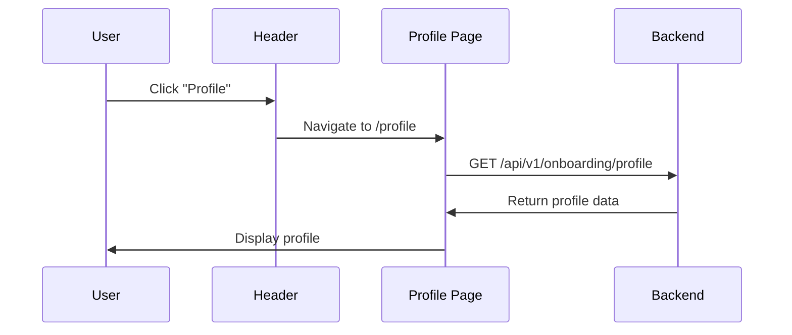
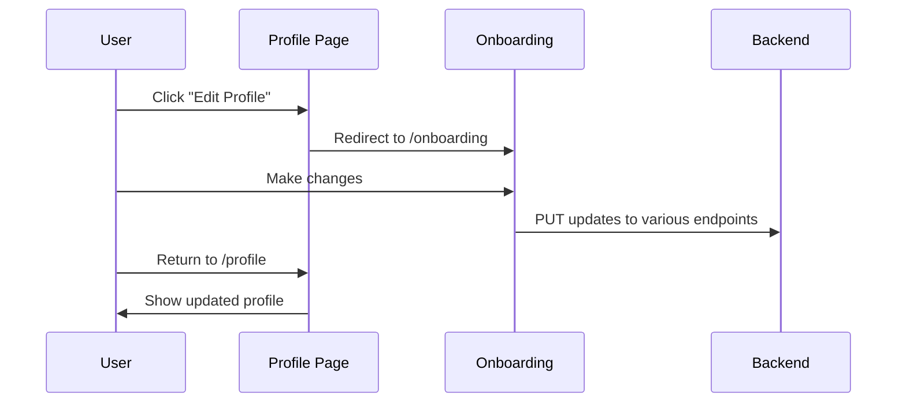
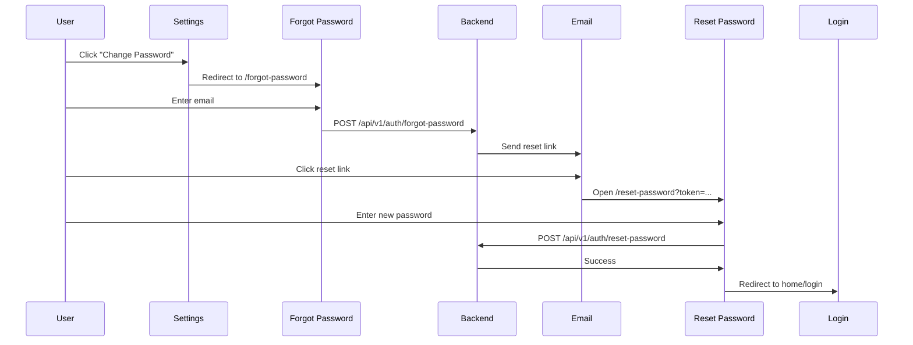

# Profile Management System

**Last Updated**: 2025-12-17
**Status**: ✅ Complete - Ready for Use

---

## 📋 Overview

The profile management system allows users to view their complete profile, access account settings, and manage their information. The system is integrated with the existing onboarding flow for editing capabilities.

---

## 🎯 Features Implemented

### 1. **Profile View Page** ([/profile](app/profile/page.tsx))

**Beautiful Profile Display**:
- **Cover Header**: Gradient background with action buttons
- **Two-Column Layout**:
  - **Left**: Profile card with primary photo, basic info, and quick stats
  - **Right**: Detailed sections (bio, photos, music, interests, lifestyle, dating preferences)
- **Responsive Design**: Works beautifully on mobile and desktop

**Sections Displayed**:
- ✅ Profile card with primary photo
- ✅ Name, age, location
- ✅ Photo gallery (Pinterest-style grid)
- ✅ About me / Bio
- ✅ Music preferences (genres, concert frequency, importance)
- ✅ Interests (badges)
- ✅ Lifestyle information (occupation, education, habits)
- ✅ Dating preferences (relationship goal, age range, distance)

**Action Buttons**:
- ✅ "Edit Profile" - Routes to onboarding for full editing
- ✅ "Settings" - Routes to account settings page

---

### 2. **Settings Page** ([/profile/settings](app/profile/settings/page.tsx))

**Account Information Section**:
- ✅ Display email address
- ✅ Show authentication method (Email or Spotify)
- ✅ Email verification status
- ✅ Resend verification email button (for unverified users)

**Security Section**:
- ✅ Change Password (for email users) - Routes to /forgot-password
- ✅ Sign Out button

**Connected Accounts Section** (Email users only):
- ✅ Spotify connection status
- ✅ Connect Spotify button (placeholder for future implementation)

**Privacy Settings Section**:
- ✅ Link to manage privacy settings via onboarding
- ✅ Information about privacy controls

**Danger Zone**:
- ✅ Delete Account button (with confirmation)
- ✅ Warning message about irreversibility

---

### 3. **Header Navigation** ([app/components/Header.tsx](app/components/Header.tsx))

**Already Implemented**:
- ✅ Profile button in header (when logged in)
- ✅ Clicking "Profile" navigates to `/profile`
- ✅ Welcome message with user's first name
- ✅ Sign Out button

---

## 📁 File Structure

```
app/
├── profile/
│   ├── page.tsx                    # Profile view page
│   └── settings/
│       └── page.tsx                # Account settings page
├── components/
│   └── Header.tsx                  # Navigation with Profile link
└── serverActions/
    ├── auth.ts                     # Auth actions (resend verification)
    └── onboarding.ts               # Get complete profile
```

---

## 🎨 UI/UX Features

### Profile Page Design

**Layout**:
- Gradient cover header (secondary/primary/accent colors)
- Floating action buttons (Edit Profile, Settings)
- Two-column responsive grid
- Sticky profile card on scroll (desktop)

**Visual Elements**:
- Profile photo with age badge overlay
- Photo gallery with hover effects
- Genre/interest badges with primary color theme
- Section icons for visual hierarchy
- Smooth transitions and hover states

**Mobile Responsive**:
- Single column layout on mobile
- Touch-friendly buttons
- Optimized image sizes
- Collapsible sections

---

### Settings Page Design

**Layout**:
- Centered single-column layout (max-width 4xl)
- Card-based sections
- Clear visual hierarchy
- Danger zone highlighted in red

**Sections**:
- Account info with icons
- Security actions
- Connected accounts (Spotify)
- Privacy controls
- Account deletion (danger zone)

**Interactive Elements**:
- Resend verification email with loading state
- Inline success/error messages
- Confirmation dialogs for destructive actions
- Navigation breadcrumbs

---

## 🔄 User Flows

### Viewing Profile



### Editing Profile



### Changing Password



---

## 🛠️ Technical Implementation

### Server Components

**Profile Page** (`app/profile/page.tsx`):
- Server component for fast initial load
- Fetches complete profile data server-side
- No client-side hydration needed for static content
- Redirects if not authenticated

**Settings Page** (`app/profile/settings/page.tsx`):
- Client component for interactivity
- Uses `useSession` hook for real-time session data
- Handles resend verification email
- Interactive buttons and state management

### Data Fetching

**Profile Data**:
```typescript
const profileResult = await getCompleteProfile();
// Returns CompleteProfileResponseDto from backend
```

**Session Data**:
```typescript
const { data: session, status } = useSession();
// Provides:
// - user info (id, name, email)
// - emailVerified status
// - authProvider (EMAIL | SPOTIFY)
// - registrationStage
```

### Backend Endpoints Used

| Endpoint | Method | Purpose |
|----------|--------|---------|
| `/api/v1/onboarding/profile` | GET | Fetch complete profile |
| `/api/v1/auth/resend-verification` | POST | Resend verification email |
| All onboarding PUT endpoints | PUT | Update profile sections |

---

## ⚙️ Configuration

### Environment Variables

No additional environment variables needed beyond existing:
- `BACKEND_API_URL` - Backend API base URL
- `NEXTAUTH_SECRET` - NextAuth secret
- `NEXTAUTH_URL` - Frontend URL

### Backend Requirements

**Profile Endpoint Must Return**:
- All onboarding data (music, lifestyle, personality, etc.)
- Photos array with URLs
- Progress information
- Basic user info

**Expected Response Shape**: See `CompleteProfileResponseDto` in [types/onboarding.d.ts](types/onboarding.d.ts)

---

## 🎯 Features to Implement (Future)

### Inline Profile Editing
Currently, editing routes to onboarding. Future enhancements:
- ✨ Edit modals for quick updates
- ✨ Inline editing for text fields
- ✨ Direct photo upload from profile page
- ✨ Section-by-section editing

### Spotify Integration
- ✨ Connect Spotify from settings
- ✨ Disconnect Spotify option
- ✨ Sync Spotify data button
- ✨ Show connection status

### Account Management
- ✨ Implement actual account deletion
- ✨ Download your data (GDPR compliance)
- ✨ Account suspension option
- ✨ Export profile information

### Additional Settings
- ✨ Notification preferences
- ✨ Email preferences
- ✨ Blocked users list
- ✨ Activity log
- ✨ Two-factor authentication

### Profile Enhancements
- ✨ Profile views counter
- ✨ Profile completeness percentage
- ✨ Social proof (verified badge)
- ✨ Profile strength meter
- ✨ Recently played tracks widget
- ✨ Concert history timeline

---

## 📝 Usage Examples

### Accessing User Profile

```typescript
// In any server component
import { getServerSession } from 'next-auth';
import { getCompleteProfile } from '@/app/serverActions/onboarding';
import { authOptions } from '@/app/api/auth/[...nextauth]/route';

const session = await getServerSession(authOptions);
const profileResult = await getCompleteProfile();

if (profileResult.ok) {
  const profile = profileResult.data;
  // Access profile.name, profile.musicPreferences, etc.
}
```

### Accessing Session in Client Component

```typescript
'use client';
import { useSession } from 'next-auth/react';

export default function MyComponent() {
  const { data: session, status } = useSession();

  if (status === 'loading') return <p>Loading...</p>;
  if (!session) return <p>Not authenticated</p>;

  return (
    <div>
      <p>Email: {session.user?.email}</p>
      <p>Verified: {(session as any).emailVerified ? 'Yes' : 'No'}</p>
      <p>Auth: {(session as any).authProvider}</p>
    </div>
  );
}
```

### Resending Verification Email

```typescript
import { resendVerificationEmail } from '@/app/serverActions/auth';

const result = await resendVerificationEmail({ email: userEmail });

if (result.ok) {
  console.log('Verification email sent!');
} else {
  console.error('Error:', result.error.message);
}
```

---

## 🧪 Testing Checklist

### Profile View Page

- [ ] Navigate to `/profile` when logged in
- [ ] Verify all sections display correctly
- [ ] Check primary photo displays
- [ ] Test photo gallery interaction
- [ ] Verify genres display as badges
- [ ] Check mobile responsive layout
- [ ] Test "Edit Profile" button (routes to /onboarding)
- [ ] Test "Settings" button (routes to /profile/settings)

### Settings Page

**Account Information**:
- [ ] Email displays correctly
- [ ] Auth provider shows correctly (Email or Spotify)
- [ ] Verification status accurate
- [ ] Resend email button works (unverified users)
- [ ] Success/error messages display

**Security**:
- [ ] "Change Password" button works (email users)
- [ ] "Sign Out" button logs out successfully

**Connected Accounts** (Email users):
- [ ] Spotify connection section displays
- [ ] Connect button shows placeholder message

**Danger Zone**:
- [ ] Delete account button shows confirmation
- [ ] Warning message displays

### Navigation

- [ ] Header "Profile" button works
- [ ] Back button in settings works
- [ ] All links navigate correctly
- [ ] Redirects work when not authenticated

---

## 🔒 Security Considerations

### Authentication

✅ **Protected Routes**:
- Profile page redirects if not authenticated
- Settings page redirects if not authenticated
- Server-side session validation

✅ **Data Access**:
- Profile data only accessible with valid JWT
- Session data from NextAuth is secure
- No sensitive data exposed in client

✅ **Actions**:
- Resend verification requires session
- Password change uses secure token flow
- Sign out clears session properly

---

## 📖 Related Documentation

- [Authentication Implementation](AUTH_IMPLEMENTATION.md) - Auth system details
- [Frontend Status](../dating-app-docs/FRONTEND_PROJECT_STATUS.md) - Overall project status
- [Backend Status](../dating-app-docs/BACKEND_PROJECT_STATUS.md) - Backend API details
- [API Specification](CLAUDE.md) - Complete API documentation

---

## 🎉 Summary

The profile management system is **fully functional** with:

✅ Beautiful profile view with all user data
✅ Comprehensive settings page
✅ Account information display
✅ Password management for email users
✅ Email verification controls
✅ Spotify connection UI (ready for backend)
✅ Account deletion option
✅ Header navigation integration
✅ Mobile responsive design
✅ Consistent UI/UX with landing page

**Users can**:
- View their complete profile
- Edit profile via onboarding
- Manage account settings
- Change password (email users)
- Resend verification emails
- Sign out
- Delete account (with confirmation)

**Next Steps**: Implement inline editing, Spotify connection, and additional account management features as needed.

---

**Status**: 🟢 Ready for Production Use
