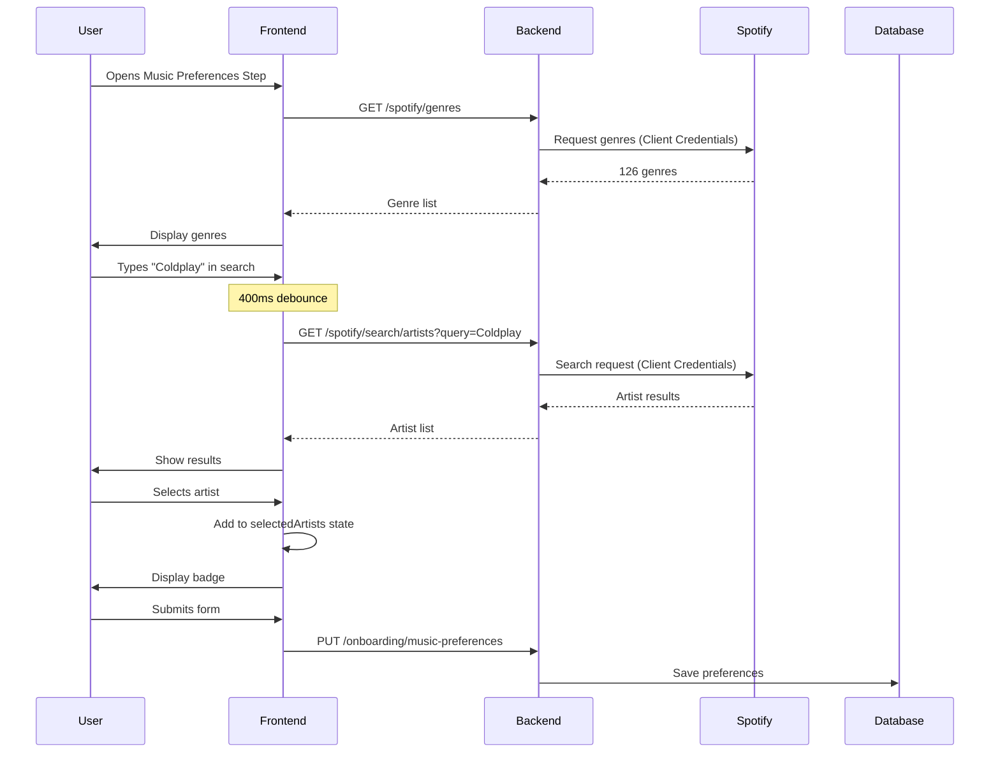

# Spotify Public API Integration Guide

**Date**: 2025-12-10
**Status**: ✅ Complete
**Integration**: Spotify Client Credentials Flow (Public Endpoints)

---

## 🎯 Overview

This integration adds support for **email/password users** who don't have Spotify accounts. Using Spotify's Client Credentials OAuth2 flow, non-Spotify users can still search for artists, browse genres, and build music preferences during onboarding.

### Key Features

✅ **Public Spotify Search** - No authentication required
✅ **Artist Search** - Search by name with debounced input
✅ **Genre Selection** - 126 Spotify genre seeds available
✅ **Automatic Caching** - Genres cached on first load
✅ **Image Support** - Artist images in multiple sizes
✅ **Pagination Ready** - Support for offset/limit params

---

## 📁 Files Created

### 1. TypeScript Types
**File**: `types/spotify-public.d.ts`

Defines all types for Spotify public API responses:
- `SpotifyImage` - Image URLs with dimensions
- `SpotifyArtist` - Full artist details
- `SpotifyTrack` - Track information
- `ArtistSearchResult` - Paginated artist search results
- `TrackSearchResult` - Paginated track search results
- `GenreSeedsResponse` - Array of genre strings
- `SelectedArtist` - Frontend-specific selected artist type
- `SelectedTrack` - Frontend-specific selected track type

### 2. API Client Utilities
**File**: `lib/spotify-public-api.ts`

Contains all API calls to backend public endpoints:

```typescript
// Search for artists
searchArtists(query: string, limit?: number, offset?: number): Promise<ArtistSearchResult>

// Search for tracks
searchTracks(query: string, limit?: number, offset?: number): Promise<TrackSearchResult>

// Get all available genres
getGenres(): Promise<GenreSeedsResponse>

// Get artist by Spotify ID
getArtistById(artistId: string): Promise<SpotifyArtist>

// Helper: Get best image URL
getBestImageUrl(images, preferredSize?: 'large'|'medium'|'small'): string | undefined

// Helper: Format duration
formatDuration(ms: number): string // Returns "MM:SS"
```

**Important**: These functions **do NOT** send JWT tokens. They are public endpoints.

### 3. React Components

#### A. **ArtistSearch Component**
**File**: `app/components/spotify/ArtistSearch.tsx`

Features:
- Debounced search input (400ms delay)
- Real-time search results dropdown
- Artist images displayed
- Genres shown for each artist
- Multi-select with max limit (default: 10)
- Selected artists displayed as badges
- Remove artists by clicking "×"
- Loading states and error handling

Props:
```typescript
{
  selectedArtists: SelectedArtist[];
  onArtistsChange: (artists: SelectedArtist[]) => void;
  maxSelection?: number;
  placeholder?: string;
}
```

#### B. **GenreSelector Component**
**File**: `app/components/spotify/GenreSelector.tsx`

Features:
- Fetches 126 Spotify genres on mount
- Displays genres as pill-shaped badges
- Multi-select with max limit (default: 10)
- Selected genres highlighted
- Converts kebab-case to Title Case (e.g., "alt-rock" → "Alt Rock")
- Shows selected count

Props:
```typescript
{
  selectedGenres: string[];
  onGenresChange: (genres: string[]) => void;
  maxSelection?: number;
}
```

#### C. **SpotifyMusicSelector Component**
**File**: `app/components/spotify/SpotifyMusicSelector.tsx`

Combined component that can show:
- **Tabbed mode** (`showTabs={true}`): Genres and Artists in separate tabs with counts
- **Unified mode** (`showTabs={false}`): Both sections visible simultaneously

Props:
```typescript
{
  selectedArtists: SelectedArtist[];
  onArtistsChange: (artists: SelectedArtist[]) => void;
  selectedGenres: string[];
  onGenresChange: (genres: string[]) => void;
  maxArtists?: number;
  maxGenres?: number;
  showTabs?: boolean;
}
```

#### D. **MusicPreferencesStepEnhanced Component**
**File**: `app/onboarding/components/steps/MusicPreferencesStepEnhanced.tsx`

Enhanced version of the Music Preferences onboarding step with:
- Toggle between "Browse Genres" and "Search Artists" modes
- Integration of `SpotifyMusicSelector`
- All existing fields (concert frequency, music importance, decades, etc.)
- Modern UI with SectionHeader
- Support for both Spotify users and email/password users

---

## 🔌 API Endpoints Used

All endpoints are **PUBLIC** and do NOT require JWT authentication.

### Base URL
```
http://localhost:8080/api/v1
```

### 1. Search Artists
```http
GET /spotify/search/artists?query={query}&limit={limit}&offset={offset}
```

**Example Request**:
```typescript
const result = await searchArtists('Coldplay', 10, 0);
```

**Example Response**:
```json
{
  "href": "https://api.spotify.com/v1/search?query=Coldplay&type=artist&offset=0&limit=10",
  "items": [
    {
      "id": "4gzpq5DPGxSnKTe4SA8HAU",
      "name": "Coldplay",
      "genres": ["permanent wave", "pop", "rock"],
      "images": [
        {
          "url": "https://i.scdn.co/image/...",
          "height": 640,
          "width": 640
        }
      ],
      "popularity": 87
    }
  ],
  "limit": 10,
  "offset": 0,
  "total": 42
}
```

### 2. Search Tracks
```http
GET /spotify/search/tracks?query={query}&limit={limit}&offset={offset}
```

**Example Request**:
```typescript
const result = await searchTracks('Yellow', 5, 0);
```

### 3. Get Genres
```http
GET /spotify/genres
```

**Example Request**:
```typescript
const genres = await getGenres();
// Returns: ["acoustic", "afrobeat", "alt-rock", ...]
```

**Response**: Array of 126 genre strings

### 4. Get Artist by ID
```http
GET /spotify/artists/{artistId}
```

**Example Request**:
```typescript
const artist = await getArtistById('4gzpq5DPGxSnKTe4SA8HAU');
```

---

## 🎨 UI/UX Features

### Debouncing
Artist and track search use **400ms debouncing** to avoid excessive API calls as the user types.

### Loading States
- Search results show spinner while loading
- Genre selector shows "Loading genres..." on mount
- Disabled states for max selection reached

### Error Handling
- Network errors display user-friendly messages
- Failed searches show "Failed to search artists. Please try again."
- Failed genre fetch shows error message with retry option

### Responsive Design
- Search dropdown: max-height 320px, scrollable
- Genre pills: wrap to multiple rows
- Artist badges: show images, wrap gracefully
- Mobile-friendly touch targets

### Visual Feedback
- Selected items highlighted with different colors
- Hover effects on badges and buttons
- Smooth transitions and animations
- Badge counts show selection progress

---

## 🚀 Usage Examples

### Example 1: Basic Artist Search

```tsx
'use client';

import { useState } from 'react';
import ArtistSearch from '@/app/components/spotify/ArtistSearch';
import type { SelectedArtist } from '@/types/spotify-public';

export default function MyComponent() {
  const [artists, setArtists] = useState<SelectedArtist[]>([]);

  return (
    <ArtistSearch
      selectedArtists={artists}
      onArtistsChange={setArtists}
      maxSelection={5}
      placeholder="Search for your favorite artists..."
    />
  );
}
```

### Example 2: Genre Selection Only

```tsx
'use client';

import { useState } from 'react';
import GenreSelector from '@/app/components/spotify/GenreSelector';

export default function MyComponent() {
  const [genres, setGenres] = useState<string[]>([]);

  return (
    <GenreSelector
      selectedGenres={genres}
      onGenresChange={setGenres}
      maxSelection={10}
    />
  );
}
```

### Example 3: Combined Selector (Tabbed)

```tsx
'use client';

import { useState } from 'react';
import SpotifyMusicSelector from '@/app/components/spotify/SpotifyMusicSelector';
import type { SelectedArtist } from '@/types/spotify-public';

export default function MyComponent() {
  const [artists, setArtists] = useState<SelectedArtist[]>([]);
  const [genres, setGenres] = useState<string[]>([]);

  return (
    <SpotifyMusicSelector
      selectedArtists={artists}
      onArtistsChange={setArtists}
      selectedGenres={genres}
      onGenresChange={setGenres}
      maxArtists={10}
      maxGenres={10}
      showTabs={true}
    />
  );
}
```

### Example 4: Integration in Onboarding

Replace the existing MusicPreferencesStep import:

```tsx
// Before
import MusicPreferencesStep from './steps/MusicPreferencesStep';

// After
import MusicPreferencesStep from './steps/MusicPreferencesStepEnhanced';
```

The enhanced version automatically detects if user has Spotify auth and provides appropriate UI.

---

## 🔧 Configuration

### Environment Variables

Ensure your `.env.local` has:

```bash
NEXT_PUBLIC_BACKEND_API_URL=http://localhost:8080/api/v1
```

If not set, it defaults to `http://localhost:8080/api/v1`.

### Backend Configuration

Backend must have these environment variables set:

```bash
SPOTIFY_CLIENT_ID=your_spotify_client_id
SPOTIFY_CLIENT_SECRET=your_spotify_client_secret
```

---

## 📊 Data Flow

### User Journey - Email/Password User



### Caching Strategy

**Genres**:
- Fetched once on component mount
- Stored in component state
- Not refetched unless page refreshes
- **Why**: Genre list rarely changes (~126 items, static)

**Artists/Tracks**:
- No caching (search is dynamic)
- Results cleared on new search
- Fresh results on every query

---

## 🧪 Testing

### Test Search Functionality

1. **Empty Query**: Should show empty results
2. **Valid Query**: Should show matching artists with images
3. **No Results**: Should show "No artists found" message
4. **Network Error**: Should show error message
5. **Max Selection**: Should disable selection when limit reached
6. **Debouncing**: Type quickly - should only search after 400ms pause

### Test Genre Selector

1. **Loading**: Should show spinner on mount
2. **Genre Display**: Should show all 126 genres
3. **Selection**: Should highlight selected genres
4. **Max Limit**: Should prevent selection beyond max
5. **Deselection**: Clicking selected genre should remove it
6. **Formatting**: "alt-rock" should display as "Alt Rock"

### Test Integration

1. **Spotify User**: Should work with existing flow
2. **Email User**: Should show manual selection UI
3. **Tab Switching**: Should preserve selections when switching tabs
4. **Form Validation**: Should require at least 1 genre
5. **Form Submission**: Should save data successfully

---

## 📝 Type Safety

All API responses are fully typed:

```typescript
// Import types
import type {
  SpotifyArtist,
  SpotifyTrack,
  ArtistSearchResult,
  TrackSearchResult,
  GenreSeedsResponse,
  SelectedArtist,
  SelectedTrack,
} from '@/types/spotify-public';

// Usage
const artists: ArtistSearchResult = await searchArtists('Coldplay');
const selectedArtist: SelectedArtist = {
  id: artist.id,
  name: artist.name,
  imageUrl: getBestImageUrl(artist.images),
  genres: artist.genres,
};
```

---

## ⚠️ Important Notes

### 1. Public Endpoints
These endpoints are **PUBLIC** and do **NOT** require JWT authentication:
- `/api/v1/spotify/search/artists`
- `/api/v1/spotify/search/tracks`
- `/api/v1/spotify/genres`
- `/api/v1/spotify/artists/{id}`

**DO NOT** send `Authorization: Bearer {token}` headers to these endpoints.

### 2. Rate Limiting
Implement debouncing (already done in ArtistSearch component) to avoid hitting Spotify API rate limits. Current debounce: **400ms**.

### 3. Image Sizes
Spotify provides images in multiple sizes (640x640, 320x320, 160x160). Use `getBestImageUrl()` helper to get the appropriate size:
- `large`: Highest resolution (640x640)
- `medium`: Middle resolution (320x320)
- `small`: Lowest resolution (160x160)

### 4. Genre IDs vs Names
Spotify uses genre "seeds" like "alt-rock", "hip-hop", etc. These are different from artist genres like "permanent wave", "indie rock". The genres from `/spotify/genres` are the seeds Spotify uses for recommendations.

### 5. Backend Data Model
Currently, `MusicPreferencesRequestDto` only stores `favoriteGenres: string[]`. If you want to store selected artists, you'll need to:
1. Add `favoriteArtistIds: string[]` to backend DTO
2. Update backend database schema
3. Modify save endpoint to accept artist IDs

---

## 🔮 Future Enhancements

### Short Term
- [ ] Add track search component (similar to artist search)
- [ ] Store selected artist IDs in backend
- [ ] Add "Recently Searched" artists cache
- [ ] Implement infinite scroll for search results

### Medium Term
- [ ] Add artist detail view (click artist → see full profile)
- [ ] Show artist popularity as visual indicator
- [ ] Filter genres by category (rock, pop, electronic, etc.)
- [ ] Add "Recommended for you" based on selections

### Long Term
- [ ] Integrate with matching algorithm
- [ ] Show compatibility % based on shared artists/genres
- [ ] Add music player preview (use Spotify preview URLs)
- [ ] Create music taste visualization

---

## 🐛 Troubleshooting

### Issue: "Failed to search artists"
**Cause**: Backend not running or CORS issues
**Fix**: Ensure backend is running on `localhost:8080` and CORS allows `localhost:3000`

### Issue: "Failed to load genres"
**Cause**: Spotify Client Credentials not configured
**Fix**: Check backend `application.yml` has `SPOTIFY_CLIENT_ID` and `SPOTIFY_CLIENT_SECRET`

### Issue: Images not displaying
**Cause**: Image URL might be null for some artists
**Fix**: Component already handles this - shows music icon placeholder

### Issue: Debouncing not working
**Cause**: useDebounce hook not imported
**Fix**: Check `app/hooks/useDebounce.ts` exists and is imported correctly

---

## 📞 API Call Examples

### JavaScript/TypeScript

```typescript
// Example 1: Search artists with error handling
try {
  const result = await searchArtists('Radiohead', 10, 0);
  console.log(`Found ${result.total} artists`);
  result.items.forEach(artist => {
    console.log(`${artist.name} - ${artist.genres.join(', ')}`);
  });
} catch (error) {
  console.error('Search failed:', error);
}

// Example 2: Get all genres
const genres = await getGenres();
console.log(`Available genres: ${genres.length}`);

// Example 3: Get artist details
const coldplay = await getArtistById('4gzpq5DPGxSnKTe4SA8HAU');
console.log(`${coldplay.name} has ${coldplay.genres.length} genres`);
```

### cURL

```bash
# Search artists
curl "http://localhost:8080/api/v1/spotify/search/artists?query=Taylor%20Swift&limit=5"

# Get genres
curl "http://localhost:8080/api/v1/spotify/genres"

# Get artist by ID
curl "http://localhost:8080/api/v1/spotify/artists/4gzpq5DPGxSnKTe4SA8HAU"
```

---

## ✅ Summary

This integration successfully adds Spotify public API support to your dating app, enabling:

✅ Email/password users can search for artists
✅ All users can browse 126 Spotify genres
✅ Debounced search prevents rate limiting
✅ Modern, Pinterest-inspired UI design
✅ Type-safe API calls with full TypeScript support
✅ Error handling and loading states
✅ Caching for performance
✅ Mobile-responsive design

**Status**: ✅ Complete and ready for use!

**Next Steps**:
1. Replace `MusicPreferencesStep` with `MusicPreferencesStepEnhanced` in onboarding flow
2. Test with both Spotify and email/password users
3. Consider extending backend to store selected artist IDs

---

**Last Updated**: 2025-12-10
**Documentation Version**: 1.0.0
